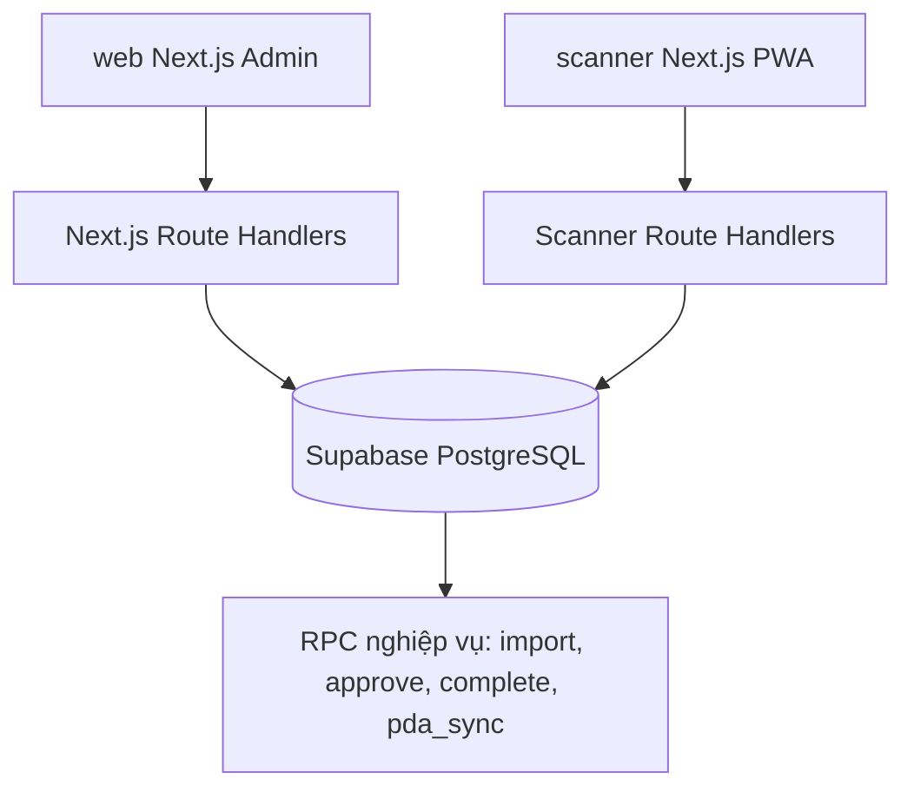

# Architecture - Inventory SaaS V2

## Mục tiêu

Giữ lại nghiệp vụ kiểm kê cũ nhưng chuyển nền sang SaaS đa công ty:

- `Company` là tenant boundary.
- `Store` là chi nhánh/cửa hàng/kho.
- `Slot` là vị trí kiểm/quét.
- `Ticket` là phiên kiểm kê.
- `Inventory` là dòng hàng sổ sách/tổng hợp.
- `InventoryDetail` là lịch sử scan thực tế.
- `PdaSync` là batch đồng bộ từ scanner.

## Kiến trúc module

## Vì sao dùng Next.js API route thay vì gọi Supabase trực tiếp?

Bản MVP cần chạy nhanh nhưng vẫn giữ boundary tốt:

- Browser không giữ `service_role`.
- API route đọc session cookie đã ký HMAC.
- API route tự filter theo `company_id`.
- Supabase chứa schema, view, RPC và có thể nâng cấp RLS strict sau.

## Trạng thái ticket

| Status | Ý nghĩa |
|---|---|
| `NEW` | Phiếu mới, chờ import nếu có dữ liệu sổ sách |
| `IMPORTING` | Đang import |
| `IMPORTED` | Đã import, chờ duyệt |
| `APPROVED` | PDA được phép tải phiếu và scan |
| `INPROCESS` | Đã có dữ liệu PDA sync |
| `COMPLETED` | Hoàn tất, không nhận thêm scan |
| `REOPEN` | Mở kiểm lại |
| `CLOSED` | Đóng kiểm lại |
| `DELETED` | Xóa mềm |

## Luồng sync PDA trong MVP

MVP xử lý trong một RPC transaction để dễ chạy local:

1. Scanner gửi batch scan.
2. RPC tạo `pda_syncs` status `PROCESSING`.
3. Insert `inventory_details`, dedupe bằng unique key `(ticket_id, user_id, barcode, scan_time)`.
4. Tạo inventory `NOTFOUND` nếu barcode chưa có trong sổ sách.
5. Tính lại `real_qty`, `diff_qty`.
6. Đổi detail sang `SYNCED`, batch sang `IMPORTED`, ticket sang `INPROCESS`.

Giai đoạn production nên tách thành queue/worker để xử lý batch lớn bất đồng bộ.

## Performance notes

- Index theo `company_id`, `ticket_id`, `barcode`, `status`.
- View `v_ticket_stats` phục vụ dashboard/report nhanh.
- Import lớn nên chunk 500-1000 rows/request.
- Scanner offline queue lưu localStorage để tránh mất dữ liệu khi mạng yếu.
